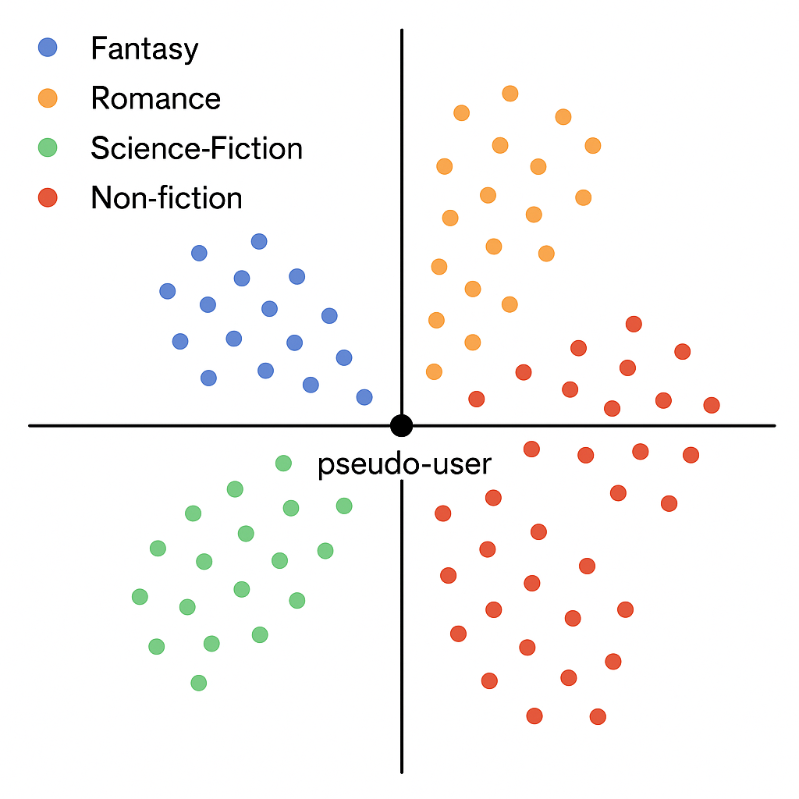

# Hardcover Recommendations



## High Level
Ingests public user book ratings and converts them into 64-dimensional “taste vectors” that represent hidden reading preferences. When a user selects one or more books they like, the vectors for those books are averaged to form a pseudo-user that represents their overall taste. This pseudo-user vector is compared against all book vectors in the model, and the closest matches in this latent space are returned as recommendations, i.e. books that readers with similar patterns also enjoyed.

## Overview
This repository contains a small three-tier app:

1. **Ingestion scripts** pull public Hardcover ratings into SQLite, train SVD factors, and rebuild the search index.
2. **FastAPI backend** (`backend/main.py`) exposes JSON endpoints for search, filters, and recommendations.
3. **React frontend** (`frontend/`) lets users pick one or more seed books and page through recommendations with book metadata.

The SQLite database stores books, users, ratings, `book_genres`, and the new `book_authors` table. Aggregated views (`book_genre_agg`, `book_author_agg`) feed an FTS5 index (`book_search`) so search results can be filtered by both genres and author names.

## Recommendation model
The app converts public user ratings into 64-dimensional taste vectors that approximate reading preferences. When a user selects one or more books they like, those book vectors are averaged into a pseudo-user profile. Recommendations are the nearest books in that latent space.

## Prerequisites

- Python 3.11+ with `pip`
- Node 18+ and npm

## Runtime data

Runtime artifacts are expected to live outside the source tree by default:

- `HARDCOVER_DB_PATH=/data/hardcover.db`
- `HARDCOVER_MODEL_PATH=/data/svd_model.npz`

Keeping the SQLite database and trained model together in `/data` makes Docker deployment simpler and avoids serving a database with a mismatched model file. For local development, you can override either path in `.env`. For production containers, prefer a non-root runtime user and mount only `/data` as writable.

## Environment setup

Copy the root `.env.example`to `.env` and fill in the Hardcover credentials. The frontend has its own `.env.example` for `VITE_API_BASE_URL`.

## Data pipeline

```bash
pip install -r requirements.txt

# 1. Initialize a fresh database
python scripts/init_db.py

# 2. Fetch user ratings + book metadata (respects API rate-limits)
python scripts/fetch_ratings.py

# 3. Train the recommender model
python scripts/train_svd.py

# 4. Rebuild the FTS5 search index once data is loaded
python scripts/rebuild_search_index.py
```

The ingestion scripts and backend both read the same env variables from `.env`.

## Backend API

```bash
uvicorn backend.main:app --reload --log-level info
```

Endpoints:

- `GET /health` – basic readiness probe.
- `GET /search?q=term&limit=10` – FTS-backed typeahead over title/genre text.
- `GET /genres?limit=50` – returns the most popular genre tags (only those with `tag_count > 2`) for UI filters.
- `GET /decades` – returns available decade filters and the count of unknown-year books.
- `GET /user-books?username=...` – fetches a Hardcover user's shelved books by username.
- `POST /recommend` – body `{ "book_ids": [...], "limit": 10, "offset": 0 }`. Returns paged recommendations enriched with cover art, genres, and description snippets.

### Environment variables

- `HARDCOVER_DB_PATH` – defaults to `/data/hardcover.db`.
- `HARDCOVER_MODEL_PATH` – defaults to `/data/svd_model.npz`.
- `HARDCOVER_CORS_ORIGINS` – comma-separated list of allowed browser origins.
- `HARDCOVER_GENRE_MIN_COUNT` – minimum `tag_count` cached in the in-memory genre index.
- `HARDCOVER_DECADE_BASE_YEAR` – first decade bucket used by the year filters.

## Frontend

```bash
cd frontend
npm install
npm run dev
```

Set `VITE_API_BASE_URL` (see `/frontend/.env.example`) to the FastAPI origin, then visit `http://localhost:5173`.

The UI supports:

- Debounced title search with suggestions (no manual `book_id` entry needed).
- Selecting/removing multiple seed books.
- Fetching the first 10 recommendations and requesting more results.
- Genre filtering with curated tag options. The UI shows only commonly used genres, and the backend fetches enough additional candidates to keep each filtered page filled with ten recommendations when possible.
- Displaying cover, title, reader count, average rating, tag chips, truncated description, and a link to Hardcover.
- Importing books from a Hardcover username.

## Docker Deployment

The repository includes a root `Dockerfile` and `docker-compose.yml` for a single-host deployment. The compose stack separates first-time initialization from the long-running app services:

- `pipeline-init` builds `/data/current` if no live release exists yet.
- `backend` serves the API from `/data/current`.
- `frontend` serves the built Vite app and injects `VITE_API_BASE_URL` at container startup.
- `pipeline-scheduler` refreshes the data pipeline on a monthly cron schedule and atomically switches `/data/current` when the full refresh succeeds.

### First startup

```bash
docker compose up --build
```

On an empty volume, `pipeline-init` runs:

1. `init_db.py`
2. `fetch_ratings.py`
3. `train_svd.py`
4. `rebuild_search_index.py`

The backend starts only after that pipeline completes successfully.

### Manual refresh

```bash
docker compose --profile manual run --rm pipeline-refresh
```

### Docker environment

- `PIPELINE_REFRESH_CRON` defaults to `0 3 1 * *` (once a month)
- `HARDCOVER_DB_PATH` should remain `/data/current/hardcover.db`
- `HARDCOVER_MODEL_PATH` should remain `/data/current/svd_model.npz`
- `VITE_API_BASE_URL` can be changed in compose without rebuilding the frontend image

The pipeline stores releases under `/data/releases/<release-id>/` and updates `/data/current` only after a new DB and model have both been generated successfully.
